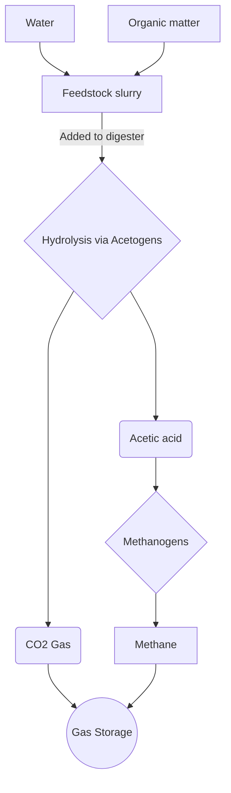

description

## Terms
- **Anaerobic Digestion** - digestion without oxygen
- **Methanogenisis** - Generation of methane from organic matter.
- **Effluent/Digestate** - the liquid fertilizer output

## Digester

![[Biogas Digester 2024-08-25 12.12.28.excalidraw.dark.svg]]
%%[[Biogas Digester 2024-08-25 12.12.28.excalidraw.md|🖋 Edit in Excalidraw]], and the [[Biogas Digester 2024-08-25 12.12.28.excalidraw.light.svg|light exported image]]%%

| Min temp (F) | Max temp (F) | Min temp (C) | Max temp (C) |
| ------------ | ------------ | ------------ | ------------ |
| 95           | 105          | 35           | 40.55        |
## Digestion Process

If you feed the digester too much/too quickly the acetogens will produce too much acid and reduce the PH, souring the digester.
## Feedstocks(Digester Inputs)
organic matter which will break down through natural decomposition. 

- Manure
- Food waste -
- Cooking oil
- Milk
- brewers spent grain
- maybe mushroom farm waste product?

Blend nutrients and water into a slurry
## Digester outputs

### Gas

| Percentage | Chemical signature | Name             |
| ---------- | ------------------ | ---------------- |
| 60%        | CH4                | Methane          |
| 39%        | CO2                | Carbon Dioxide   |
| 1%         | H2S                | Hydrogen Sulfide |

### Effluent
