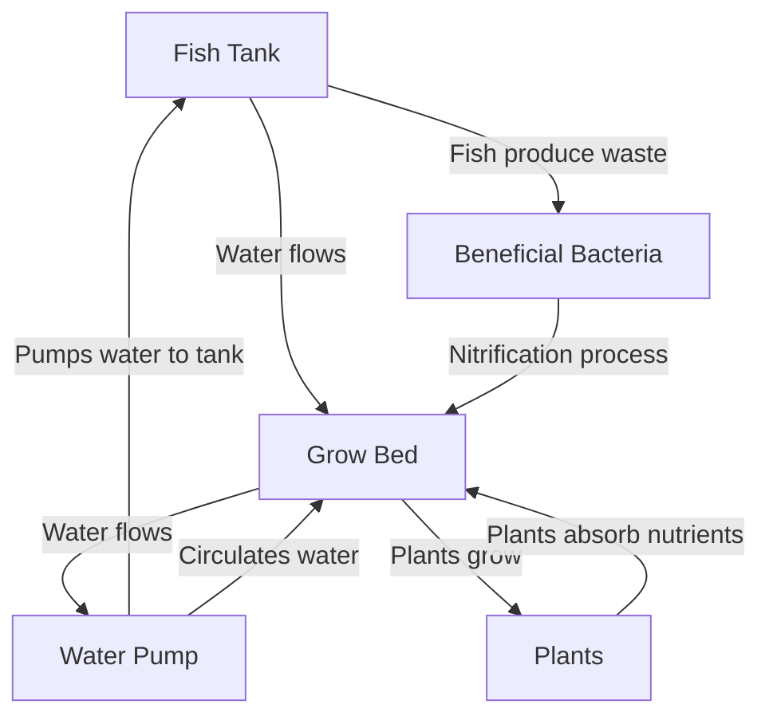

# Aquaponics Lesson Plan for Grades K-5

**Grade Level:** K-5
**Subject:** Science/Environmental Education
**Lesson Duration:** 60 minutes
**Topic:** Introduction to Aquaponics

## **Objective:**

Students will learn about the basics of aquaponics, including the symbiotic relationship between plants and fish, and how this system can be used to grow food in a sustainable way. The students will also engage in hands-on activities to reinforce their understanding of the topic.

>[!todo]
>- [ ] Fix the cycle diagram cause its confusing and horrible.

---

### **Materials Needed:**

- Small aquarium or fish tank (for demo)
- Fish (e.g., goldfish or beta fish)
- Plastic Fish
- Plants in net pots(e.g., basil, lettuce, or small herbs)
- Water (to fill tank)
- Fish food
- Whiteboard and markers
- Aquaponics system diagram (visual aid)
- Chart paper or large poster for group work
- Plastic cups or small containers (optional for a hands-on activity)
- Soil (optional)

---

## **Lesson Outline:**

### **1. Introduction to Aquaponics (10 minutes)**

**Objective:** Introduce the concept of aquaponics in simple terms.

#### Start with a question
- "What do fish need to live?" (Answer: Water, food, oxygen) 
- "What do plants need to grow?" (Answer: Sunlight, water, soil)

#### Introduce the concept of Aquaponics
Explain that aquaponics is a system where fish and plants work together to help each other grow. In aquaponics, fish provide nutrients for the plants, and the plants clean the water for the fish. The fish can also eat the plants depending on what is growing.

**Key Points
- Fish produce waste (ammonia) that can be harmful to them.
- Plants use this waste as fertilizer.
- The plants filter the water, cleaning it for the fish.
- This creates a cycle that helps both plants and fish thrive.
- Show a diagram of an aquaponics system to visually explain the cycle.

### 2. Hands-On Activity: "Building a Simple Aquaponics System" (20 minutes)

**Objective:** Allow students to explore the idea of aquaponics through a simple hands-on activity.

**Instructions:**

1. **Show the students the small fish tank**
2. **Next, show them the plants** in pots or containers.
3. **Explain** that in a real aquaponics system, the plants are usually placed in a growing bed above the fish tank, and the water from the fish tank circulates to the plants.

#### Option 1: Container Aquaponics (Grades 3-5):
- Give each student or small group a plastic cup with a plastic fish and a small potted plant.
- Have the students use their hands to simulate the movement of water from the fish tank to the plants by pouring water between the two containers.
- Discuss how the fish's waste fertilizes the plants, and how the plants clean the water for the fish.

#### Option 2: Water and Soil Experiment (Grades K-2):
- If you're working with younger grades (K-2), you can make this activity simpler by using soil and plants, simulating the nutrient cycle in an easier way. Fill a small container with soil, and have students plant seeds, discussing how plants need nutrients to grow.

---

### 3. Discussion and Reflection (10 minutes)

**Objective:** Help students understand the practical uses of aquaponics and reinforce the learning objectives.

#### Ask Discussion Questions
- Why do you think aquaponics is a good way to grow food?
- How do fish and plants help each other in an aquaponics system?
- What would happen if one part of the system stopped working? (e.g., if the plants didn't filter the water)

#### Introduce Real-World Applications
Explain that aquaponics is used by farmers to grow food in places where it's hard to grow traditional crops. It's also a great way to grow food in cities, schools, or even homes.

---

### 4. Group Work: Create a "Dream Aquaponics Garden" (15 minutes)

**Objective:** Foster creativity and teamwork while reinforcing the concept.

#### Instructions

- **Divide students into small groups** and give them chart paper, markers, and any other materials available.
- Have each group **create a "dream aquaponics garden"** on the chart paper. This can include:
	- A drawing of the fish tank, plants, and the water cycle.
	- Labels explaining how each part of the system works.
	- Additional ideas for plants or fish they would like to grow in an aquaponics system.

---

### 5. Conclusion and Wrap-Up (5 minutes)

**Objective:** Summarize key concepts and encourage further exploration.

- **Review:** Ask students to share their dream aquaponics garden and one thing they learned today about how fish and plants work together.
- **Final Thought:** Explain that aquaponics is not only fun but also helps conserve water and grow food in an environmentally friendly way.
- **Optional Extension:** Encourage students to research more about aquaponics at home or bring in any questions they may have for the next class.

---

## Assessment:

- **Formative Assessment:** Participation in discussions, group work, and the hands-on activity.
- **Summary Assessment:** Have students draw their own version of an aquaponics system and label the key components (fish, water, plants, and cycle).

---

## Extensions and Adaptations:

- **For Older Grades (3-5):**  
	- Dive deeper into the science behind the nitrogen cycle, discussing how ammonia is converted into nitrites and nitrates by bacteria, and how this benefits both plants and fish. You can also introduce the concept of pH balance in water.

- **For Younger Grades (K-2):**  
	- Focus more on the basic concept of how fish and plants help each other, and engage students with a simpler hands-on activity using plastic cups, plant pots, and toy fish.
