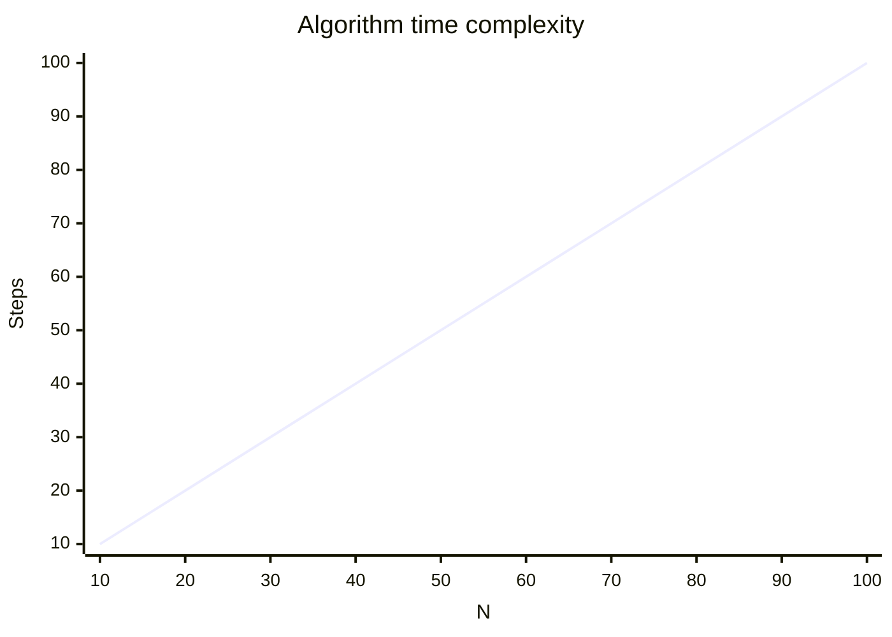

---
tags:
  - Resources/YouTube/FreeCodeCamp
  - Areas/Programming/Algorithms
  - Areas/Programming/Data_structures
---

# "Algorithms and Data Structures Tutorial - Full Course for Beginners" by FreeCodeCamp.org

>[!abstract]+
>Following along to a [FreeCodeCamp Video](https://youtu.be/8hly31xKli0?si=ylhdKgudyq-YgUM-) covering algorithms and data structures.

## Terms
1. **Algorithm** - A set of steps or instructions for completing a task. in CS it more often means ==the set of steps a program takes to finish a task.== 
2. **Algorithmic thinking** - Solving problems by breaking it down step by step and applying an specific strategy
3. **Time complexity** - Simply the amount of time an algorithm takes to solve the problem
4. **Space complexity** - the amount of memory required to run the algorithm

## Timestamps
>[!info]- Timestamps
>**Introduction to Algorithms**
**( Playing a Counting Game )**
0:25 - What Is an Algorithm?
6:50 - Guess the Number
12:46 - Defining an Algorithm
21:15 - Evaluating Linear Search
29:58 - Evaluating Binary Search
**Introduction to Algorithms
( Time Complexity )**
36:11 - Efficiency of an Algorithm
42:39 - Constant and Logarithmic Time
49:11 - Linear & Quadratic Time
53:48 - Quasilinear Time
56:23 - Exponential Time
1:04:23 - Determining Complexity
**Introduction to Algorithms
( Algorithms in Code )**
1:08:22 - Linear Search in Code
1:18:02 - Binary Search in Code
1:28:06 - Recursive Binary Search
**Introduction to Algorithms
( Recursion and Space Complexity )**
1:41:14 - Recursive Functions
1:46:18 - Space Complexity
1:53:07 - Recap of Algorithms in Code
**Introduction to Data Structures
( Exploring Arrays )**
1:57:44 - Introduction
2:00:40 - Array Basics
2:06:20 - Accessing a Value in an Array
2:13:06 - Array Search, Insert and Delete
**Introduction to Data Structures
( Building a Linked List )**
2:22:57 - What Is a Linked List?
2:36:15 - Adding Nodes to a Linked List
2:44:05 - Implementing Search
2:48:34 - Inserting a Node
2:55:20 - Removing a Node
**Introduction to Data Structures**
**( The Merge Sort Algorithm )**
3:03:06 - Merge Sort
3:11:13 - Splitting Into Sublists
3:14:27 - Recursively Merging Sublists
3:21:34 - Ensuring the Correctness of Merge Sort
3:28:17 - Evaluating the Runtime of Merge Sort
**Introduction to Data Structures**
**( Sorting a Linked List )**
3:35:40 - The Merge Function
3:40:31 - The Divide Step
3:47:56 - The Conquer Step
4:00:11 - Evaluating the Runtime
4:08:46 - Recap of Introduction to Data Structures
**Algorithms: Sorting and Searching**
**( Sorting Algorithms )**
4:11:02 - Sorting and Searching
4:14:56 - Bogosort
4:20:36 - Selection Sort
4:27:11 - Getting the Run Time of a Program
4:31:17 - Recursion
4:41:18 - Quicksort
4:47:12 - Implementing Quicksort
4:52:34 - Merge Sort
4:59:45 - Actual Run Time for Sorting Algorithms
5:02:00 - Big-O Run Times of Sorting Algorithms
**Algorithms: Sorting and Searching**
**( Searching Names )**
5:07:42 - Linear Search
5:12:04 - Sorting Names
5:14:04 - Binary Search
5:19:22 - Timing Our Search Scripts
5:20:41 - Big O Runtime of Search Algorithms

## Algorithms
 "the set of steps a program takes to finish a task."

- Simple search, Linear search, Sequential search
- Binary Search
## Data structures

## Notes
- lots of ways to solve the same problem
- not enough to know all the different algorithms, you also need to know when to apply them
- algorithmic thinking is more important than knowing all the common algorithms
- Algorithms must have a clear problem statement.
- each step in your algorithm must be atomic and unable to be broken down further
- algorithms should produce a result even if that result is *null*

### Intro
>[!tip]+ Algorithmic thinking
>To apply an algorithm:
>1. gain an understanding of the problem at hand
>2. break the problem into several steps
>3. apply the appropriate algorithm

### Guess the number
guys strat was to brute force by guessing each number starting at 1 and moving up.
therefore hewill need as many guesses as the number is, **if the number is 10 he needs to guess 10 times.**

girls strat was much more methodic, guessing a number in the halfway point (5) and when she is told thats too low she guesses a number halfway between 6 and 10 (8), too low so she guesses 9 and then 10. in this example **she only needed to guess 4 times. **

>[!todo]+ Algorithm Requirements
>- [ ] Ingredients
>	- [ ] clearly defined problem statement
>	- [ ] input
>	- [ ] output
>- [ ] other requirements
>	- [ ] Algorithm steps must be in a very specific order
>	- [ ] the steps must be distinct/atomic
>	- [ ] the algorithm should produce a result
>	- [ ] the algorithm should complete in a finite amount of time

 
Efficiency is measured by time and space.
- time complexity
- space complexity

you can measure how long it takes in the:
- Best case
- worst case
- Average

## Sequential search

## Binary search

| Key                                                      | Answer                                                                                                                                                                                                                                                   |
| -------------------------------------------------------- | ----------------------------------------------------------------------------------------------------------------------------------------------------------------------------------------------------------------------------------------------------- |
| **Input**                                                | A sorted list of                                                                                                                                                                                                                                         |
| **Output**                                               | The position in the list of the target value we are searching for or a output indicating the target does n                                                                                                                                               |
| **Problem statement**                                                                                                                                                                                                                                                                                               |
| **Steps**                                   1. Goto the middle element of the ordered list. 2. compare the current element to the target element.  3. **if** current element = target element **then** return the current element and end. 4. if current element < target element then   ment then   ment  |
| **Steps in specific order?**                                                                                                                                                                                                                                                                                        |
| **Each step is distinct?**                                                                                                                                                                                                                                                                                          |
| **Algorithm produces a result?**                                                                                                                                                                                                                                                                                    |
| **Algorithm completes in a in a finite amount                                                                                                                                                                                                                                                                       |

