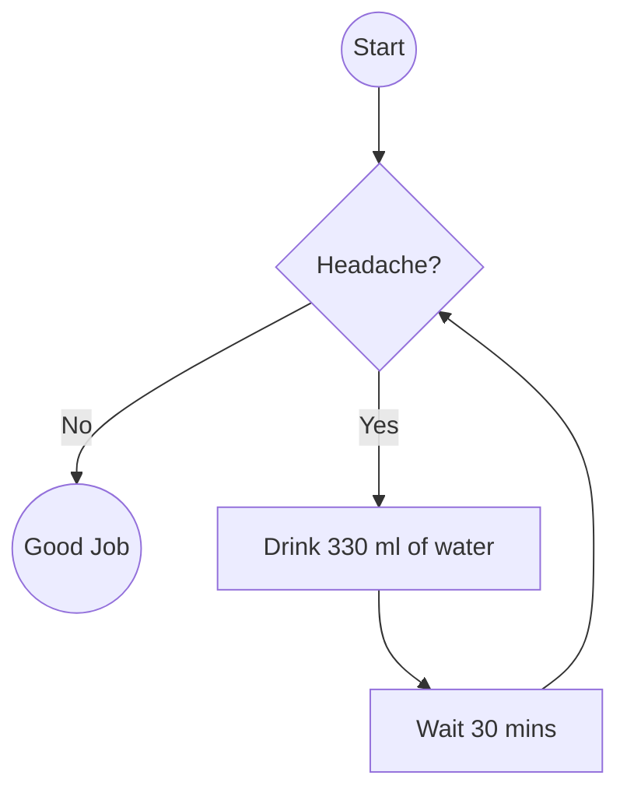

---
tags:
  - Resources/YouTube/NoBoilerplate
---

# Hack your brain with elaborate coping mechanisms
1. Declare bankruptcy on your memory
	1. we both know that you forget everything. dont feel bad about it, just accept it.
2. Carry a notebook
	1. Start writing down all the important shit. its called active externalism apparently.
	2. maybe i can use it as a password manager? no, too insecure.
3. Calendars are great
	1. I should try to get a digital calendar on all my platforms. is google calendar really all that evil? probably. but you need a calendar
	2. tasks are not events. if you can do it before the date and time its a task, not an event.
4. Getting Things Done
	1. its a task management system with location tags to filter out computer based tasks when not at a computer for example
5. carry earplugs
	1. i dont think this applies to me as much but i miss having headphones. i feel like i learned more and better when i had headphones.
	2. earplugs would be nice though i suppose
6. in the face of ambiguity, refuse the temptation to guess.
	1. if neurotypicals say some confusing shit or dont give enough information just say "I'm sorry, i don't understand." and repeat it if they still are confusing
7. Use a note-taking system.
	1. linking between notes is a very cool and helpful feature that i dont use enough
	2. i should store my notes publicly like on github or something
8. plain text lasts forever
	1. apps go out of date, plain text doesn't 
	2. use your notetaking system before opening the browser or other things that suck your attention.
	3. i should use the internet to help me accomplish the tasks that i want to accomplish. it sometimes seems like i passively use the internet and it doesnt seem to improve my life
9. Eat the frog
	1. do the least pleasant/hardest task first. it will ensure it gets done and make the rest of the day a breeze.
10. Build habits then chain them together
	1. what is the thing that triggers you to do a thing? (location, song, person,thought)
	2. build a feedback loop that encourages you to do the things you want to do and chain them together
11. Public speaking is important
	1. figure out how people who are good at explaining their thoughts do it.
12. imitate, imitate, imitate
13. negative emotions are not very useful
	1. focus on positive emotions
	2. but don't ignore the negatives
	3. ==notice the negitives, but feel the positives==
14. FOCUS
	1. pick one thing and do/learn it.
	2. its ok to want to learn multiple things but multitasking isnt real, you have to focus on one thing at a time.
	3. read important things deeply. 
	4. maybe use an rss feed??
15. Just do a bit
	1. "just put one word after another until its done. its that easy, and that hard"
	2. i used to work out all the time and was super fit, im convinced that the key was a promise to myself to just do 1 pushup and if i do more then great but if i dont then at least i did 1 pushup. right?
16. Timers are great
	1. using the pomodoro technique works. work for 20 minutes, then have a 5 minute break. repeat.
	2. maybe make a daily schedule?
17. Humanize, Organize, Mechanize.
	1. Humanize - do everything manually, (on paper if necessary) for many iterations
	2. Organize - notice the patterns that are naturally developing in your method
	3. Mechanize - automate those methods by writing checklists, flowcharts, and software. [^Flowchart_Example]

### Flowchart example:

