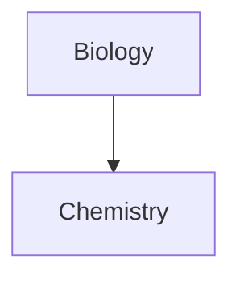
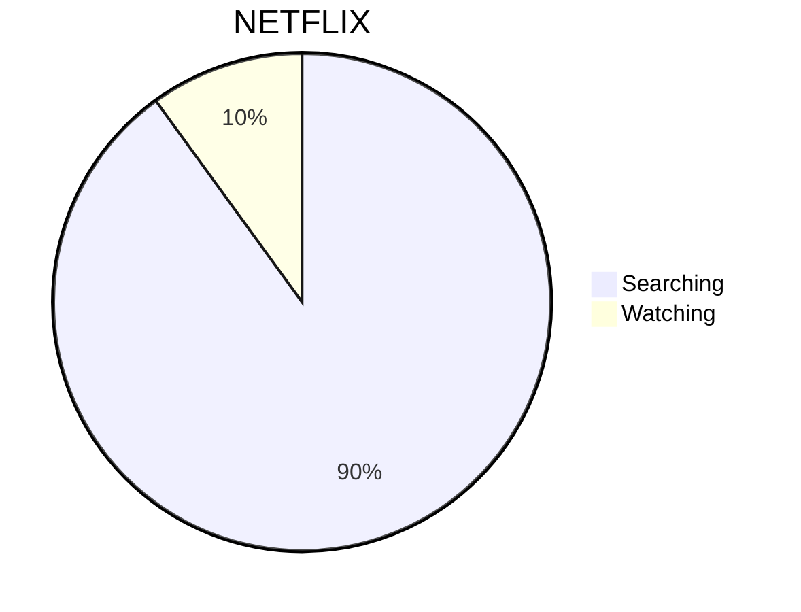

---
config:
  kanban:
    ticketBaseUrl: 'https://mermaidchart.atlassian.net/browse/#TICKET#'
---

# Markdown reference test
This note can be used as a reference for markdown styling and behavior.

---
## Headings
```markdown
# H1
followed by some text
```

```markdown
## H2
followed by some text
```

```markdown
### H3
followed by some text
```

```markdown
#### H4
followed by some text
```

```markdown
##### H5
followed by some text
```

```markdown
###### H6
followed by some text
```

---
## Tables

| Left-aligned text | Center-aligned text | Right-aligned text |
| :---------------- | :-----------------: | -----------------: |
| Content           |       Content       |            Content |

| First column                                                                      | Second column                                                                                                      |
| --------------------------------------------------------------------------------- | ------------------------------------------------------------------------------------------------------------------ |
| [Internal links](https://help.obsidian.md/Linking+notes+and+files/Internal+links) | Link to a file _within_ your **vault**.                                                                            |
| [Embed files](https://help.obsidian.md/Linking+notes+and+files/Embed+files)       |  |

---
## Styling

| Style                  | Syntax                 | Example                                  | Output                                 |
| ---------------------- | ---------------------- | ---------------------------------------- | -------------------------------------- |
| Bold                   | `** **` or `__ __`     | `**Bold text**`                          | **Bold text**                          |
| Italic                 | `* *` or `_ _`         | `*Italic text*`                          | _Italic text_                          |
| Strikethrough          | `~~ ~~`                | `~~Striked out text~~`                   | ~~Striked out text~~                   |
| Highlight              | `== ==`                | `==Highlighted text==`                   | ==Highlighted text==                   |
| Bold and nested italic | `** **` and `_ _`      | `**Bold text and _nested italic_ text**` | **Bold text and _nested italic_ text** |
| Bold and italic        | `*** ***` or `___ ___` | `***Bold and italic text***`             | ***Bold and italic text***             |

------
## Code blocks

### 4 space indent
    def this_is
      puts "some #{4-space-indent} code"
    end

### Code tag
<code>
def this_is
  puts "some #{code tag} code"
end
</code>

### Pre tag
<pre>
def this_is
  puts "some #{pre tag} code"
end
</pre>

### Fenced code
```
def this_is
  puts "some #{fenced} code"
end
```

### Syntax highlighting

#### Ruby
```ruby
class Classy
  def this_is
    puts "some #{colored} ruby code with ruby syntax highlighting"
    @someobj.do_it(1, 2)
  end
end
```

#### Javascript
```javascript
var test = function this_is(){
  console.log("some" + colored + "javascript code with javascript syntax highlighting really long");
}
```

```js
var test = function this_is(){
  console.log("language declared as 'js' instead");
}
```

#### Clojure
```clojure
(defproject myproject "0.5.0-SNAPSHOT"
  :description "Some clojure code with syntax highlighting."
  :dependencies [[org.clojure/clojure "1.5.1"]]
  :plugins [[lein-tar "3.2.0"]])
```

#### Bogus_language
```bogus_language
var test = function this_is(){
  console.log("language declared as bogus_language");
}
```

---

## Call-outs

### Call-out features
#### Fold-able (Default to folded)
> [!faq]- Are callouts foldable?
> Yes! In a foldable callout, the contents are hidden when the callout is collapsed.

#### Fold-able (Default to unfolded)
> [!faq]+ Are callouts foldable?
> Yes! In a foldable callout, the contents are hidden when the callout is collapsed.

#### Custom names
> [!tip] Callouts can have custom titles
> Like this one.

### Call-out types
#### Note
> [!note]
> Lorem ipsum dolor sit amet

#### Abstract
> [!abstract]
> Lorem ipsum dolor sit amet

Aliases: summary, tldr

#### Info
> [!info]
> Lorem ipsum dolor sit amet


#### Todo
> [!todo]
> Lorem ipsum dolor sit amet

#### Tip
> [!tip]
> Lorem ipsum dolor sit amet

Aliases: hint, important
#### Success
> [!success]
> Lorem ipsum dolor sit amet

Aliases: check, done
#### Question
> [!question]
> Lorem ipsum dolor sit amet

Aliases: help, faq
#### Warning
> [!warning]
> Lorem ipsum dolor sit amet

Aliases: caution, attention
#### Failure
> [!failure]
> Lorem ipsum dolor sit amet

Aliases: fail, missing
#### Danger
> [!danger]
> Lorem ipsum dolor sit amet

Alias: error
#### Bug
> [!bug]
> Lorem ipsum dolor sit amet

#### Example
> [!example]
> Lorem ipsum dolor sit amet

#### Quote
> [!quote]
> Lorem ipsum dolor sit amet

Alias: cite

---

## Footnotes
You can add footnotes to your notes using the following syntax:

### Simple footnote

`This is a simple footnote[^1].`

This is a simple footnote[^1].

### Named footnotes

`this is a named footnote[^note].`

this is a named footnote[^note].

### Referenced text

`[^1]: This is the referenced text.`

[^1]: This is the referenced text.

### Referenced text (Multiple lines)

```
[^2]: Add 2 spaces at the start of each new line.
  This lets you write footnotes that span multiple lines.
```

[^2]: Add 2 spaces at the start of each new line.
  This lets you write footnotes that span multiple lines.

### Referenced text (Named)

`[^note]: This is the referenced text.`

[^note]: Named footnotes still appear as numbers, but can make it easier to identify and link references.

---
## Embed image


## Mermaid diagrams




---



---
## Extra

### Comments
This is an %%inline%% comment.

%%
This is a block comment.

Block comments can span multiple lines.
%%
